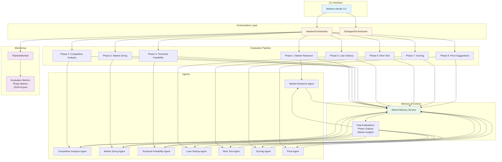

# Ideation-Claude

Multi-agent problem validator and solution finder using Claude CLI instances.

Unlike traditional agent frameworks (CrewAI, LangChain), this project runs each agent as a **real Claude Code CLI instance**, leveraging the full power of Claude's capabilities including web search, file operations, and tool use.

## Architecture

The Ideation-Claude system uses a multi-agent orchestration pattern to validate problems and find solutions through multiple specialized phases:



### Architecture Components

**CLI Interface (`main.py`)**
- Entry point for user interactions
- Handles argument parsing and command routing
- Supports manual evaluation, batch processing, and interactive mode

**Orchestration Layer**
- **IdeationOrchestrator**: Direct SDK mode - orchestrates agents sequentially
- **SubAgentOrchestrator**: Sub-agent mode - single coordinator spawns specialized sub-agents
- Manages pipeline state, phase transitions, and result aggregation

**Evaluation Pipeline (Split into Problem & Solution Validation)**

The evaluation is split into two distinct phases, with a focus on problem validation first:

**Problem Validation Phase** (Runs First):
1. **Market Research**: Industry trends, customer pain points
2. **Market Sizing**: TAM/SAM/SOM calculations
3. **Customer Discovery**: Mom Test interview planning
4. **Problem Scoring**: 8 problem-focused criteria (Problem Clarity, Market Need, Market Size, Customer Validation, Problem Urgency, Problem Frequency, Problem Severity, Evidence Quality)

**Solution Validation Phase** (Runs After Problem Validation Passes):
1. **Competitive Analysis**: Competitor landscape, differentiation
2. **Technical Feasibility**: Technology requirements, implementation complexity, resource availability
3. **Lean Startup**: Hypothesis extraction, MVP definition
4. **Solution Scoring**: 8 solution-focused criteria (Solution Fit, Competitive Advantage, Technical Feasibility, Resource Availability, MVP Clarity, Assumption Testability, Solution Timing, Solution Scalability)

**Final Decision**:
- Combined score: 60% problem + 40% solution (weighted)
- Early elimination if problem validation fails
- Pivot suggestions for eliminated problems

**Memory Service (Mem0)**
- Stores all evaluated problems and their outcomes
- Maintains phase-level outputs for context
- Provides market insights and similar problem detection
- Supports pending problems queue for batch processing

**Monitoring System**
- Real-time progress tracking with `rich` library
- Phase-level metrics collection
- Evaluation-level aggregation
- JSON export for analysis

### Data Flow

1. **Input**: User provides problem(s) via CLI or GitHub Actions
2. **Orchestration**: Orchestrator initializes pipeline state
3. **Problem Validation Phase**:
   - Market research and pain point analysis
   - Market sizing (TAM/SAM/SOM)
   - Customer discovery planning
   - Problem scoring (8 problem-focused criteria)
4. **Early Elimination Check**: If problem validation fails, stop and eliminate
5. **Solution Validation Phase** (if problem validated):
   - Competitor analysis
   - Technical feasibility assessment
   - Hypothesis and MVP definition
   - Solution scoring (8 solution-focused criteria)
6. **Context Retrieval**: Agents query Mem0 for relevant past evaluations throughout
7. **Agent Execution**: Claude Code CLI agents perform analysis
8. **Memory Storage**: Phase outputs saved to Mem0
9. **Final Scoring**: Combined score (60% problem + 40% solution)
10. **Decision**: Problem passes (combined score ≥ threshold) or is eliminated
11. **Output**: Report generated with full analysis and recommendations

## Features

- **Problem-First Validation**: Validates the problem before evaluating the solution
- **Early Elimination**: Stops immediately if problem validation fails, saving time and resources
- **9 Specialized Agents**: Each with a specific role in the validation pipeline
- **Two-Phase Pipeline**: Problem validation (4 phases) → Solution validation (4 phases)
- **Weighted Scoring**: 60% problem score + 40% solution score for final decision
- **Problem-Only Mode**: `--problem-only` flag to focus solely on problem validation
- **Lean Startup Methodology**: Hypothesis extraction and MVP definition
- **Mom Test Framework**: Customer discovery interview planning
- **16-Criteria Scoring**: 8 problem-focused + 8 solution-focused criteria
- **Pivot Suggestions**: Strategic alternatives for eliminated problems
- **Memory Integration**: Comprehensive Mem0 integration for storing all problems, phase outputs, and building a knowledge base

## Pipeline (Problem-First Validation with Early Elimination)

```
PROBLEM VALIDATION PHASE (Focus on Problem)
Phase 1: Market Research (Pain Points & Trends)
            ↓
Phase 2: Market Sizing (TAM/SAM/SOM)
            ↓
Phase 3: Customer Discovery (Mom Test Planning)
            ↓
Phase 4: Problem Scoring (8 problem-focused criteria)
            ↓
         ┌─ Problem Validated? ─┐
         │                      │
         NO                     YES
         │                      │
         ↓                      ↓
    ELIMINATE          SOLUTION VALIDATION PHASE
    (Stop Early)       (Focus on Solution)
                            ↓
                    Phase 1: Competitor Analysis
                            ↓
                    Phase 2: Technical Feasibility
                            ↓
                    Phase 3: Hypothesis & MVP
                            ↓
                    Phase 4: Solution Scoring (8 solution-focused criteria)
                            ↓
                    Phase 5: ┌─ Pivot Suggestions ─┐
                             └─ Report Generation ─┘ (if eliminated)
```

**Key Features:**
- **Problem-First Approach**: Validates the problem before evaluating the solution
- **Early Elimination**: Stops immediately if problem validation fails
- **Weighted Scoring**: 60% problem score + 40% solution score
- **9 agents, 2-phase pipeline** - Focused validation reduces wasted effort on unvalidated problems

## Installation

### Option 1: Python Installation (Recommended for Development)

```bash
# Clone the repo
git clone https://github.com/0xtechdean/ideation-claude.git
cd ideation-claude

# Create virtual environment
python -m venv .venv
source .venv/bin/activate

# Install dependencies
pip install -e .

# Set up environment variables
cp .env.example .env
# Edit .env with your API keys
```

### Option 2: Docker Installation (Recommended for Production)

```bash
# Clone the repo
git clone https://github.com/0xtechdean/ideation-claude.git
cd ideation-claude

# Set up environment variables
cp .env.example .env
# Edit .env with your API keys

# Build the Docker image
docker build -t ideation-claude:latest .

# Or use docker-compose (recommended)
docker-compose build
```

## Usage

### Python CLI Usage

```bash
# Evaluate a problem statement
ideation-claude "Legal research is too time-consuming and expensive"

# Evaluate multiple problems
ideation-claude "Finding sustainable packaging is difficult" "Personal finance management is confusing"

# Interactive mode
ideation-claude --interactive

# With custom threshold (default: 5.0)
ideation-claude --threshold 6.0 "Your problem"

# Save report to file
ideation-claude --output report.md "Your problem"

# Problem validation only
ideation-claude --problem-only "Your problem"

# With metrics and monitoring
ideation-claude --metrics "Your problem"

# Problem validation only (focus on validating the problem)
ideation-claude --problem-only "Your problem"

# Full validation (problem + solution, default)
ideation-claude "Your problem"
```

### Docker Usage

**Using Docker directly:**

```bash
# Single problem evaluation
docker run --rm \
  -v "$PWD/.env:/app/.env:ro" \
  -v "$PWD/reports:/app/reports" \
  ideation-claude:latest \
  "Legal research is too time-consuming and expensive"

# Multiple problems
docker run --rm \
  -v "$PWD/.env:/app/.env:ro" \
  -v "$PWD/reports:/app/reports" \
  ideation-claude:latest \
  "Problem 1" "Problem 2" "Problem 3"

# With custom threshold
docker run --rm \
  -v "$PWD/.env:/app/.env:ro" \
  -v "$PWD/reports:/app/reports" \
  ideation-claude:latest \
  --threshold 6.0 "Your problem"

# Problem validation only
docker run --rm \
  -v "$PWD/.env:/app/.env:ro" \
  -v "$PWD/reports:/app/reports" \
  ideation-claude:latest \
  --problem-only "Your problem"
```

**Using docker-compose (recommended):**

```bash
# Evaluate a single problem
docker-compose run --rm ideation-claude "Legal research is too time-consuming and expensive"

# Evaluate multiple problems
docker-compose run --rm ideation-claude "Problem 1" "Problem 2" "Problem 3"

# With options
docker-compose run --rm ideation-claude --threshold 6.0 --problem-only "Your problem"

# Interactive mode
docker-compose run --rm ideation-claude --interactive
```

**Note:** Reports and outputs are automatically saved to the `reports/` directory on your host machine.

## Requirements

- Python 3.10+
- Claude Code CLI installed and authenticated
- Anthropic API key (for Claude)
- Mem0 API key (optional, for cloud memory)
- OpenAI API key (for local Mem0 embeddings)

## Environment Variables

Environment variables are loaded from a `.env` file in the project root. Each user should create their own `.env` file (it's gitignored and won't be committed).

**Setup:**

```bash
# Copy the example file
cp .env.example .env

# Edit .env with your actual API keys
# Use your preferred editor (nano, vim, VS Code, etc.)
```

**Required variables:**

```bash
ANTHROPIC_API_KEY=your_key_here  # Required
```

**Optional variables:**

```bash
MEM0_API_KEY=your_key_here      # Optional: For cloud memory storage
OPENAI_API_KEY=your_key_here     # Optional: For local Mem0 embeddings
MEM0_USER_ID=ideation_claude    # Optional: Defaults to "ideation_claude"
```

The `.env` file is automatically loaded when you run the CLI. You can also set these as system environment variables if you prefer.

## Architecture

Each agent is a Claude CLI invocation with:
- A specialized system prompt (`.md` file)
- Access to specific tools (WebSearch, Read, etc.)
- Context passed explicitly between phases

The orchestrator manages the pipeline using `asyncio.gather()` to run independent agents in parallel.

## Memory Integration (Mem0)

The project uses Mem0 to build a comprehensive knowledge base of evaluated problems and market intelligence. This enables:

### What Gets Stored

1. **All Evaluated Problems** (both passed and eliminated)
   - Problem statement, status, score, threshold
   - Complete evaluation results
   - Timestamp and metadata

2. **Phase Outputs** (stored separately for knowledge building)
   - Research insights
   - Competitor analysis
   - Market sizing data
   - Resource findings
   - Hypothesis and MVP definitions
   - Customer discovery plans

3. **Phase Summaries** (concise summaries after each phase)
   - 2-3 sentence summaries of key findings
   - Generated automatically after each phase
   - Focus on actionable insights
   - Stored with type 'phase_summary' for easy retrieval
   - Available for all phases: research, market_sizing, customer_discovery, 
     competitor_analysis, resource_findings, hypothesis, problem_validation, 
     solution_validation

4. **Market Intelligence**
   - Searchable insights across all evaluations
   - Patterns and trends
   - Similar problem detection

### How It Works

- **Automatic Storage**: All evaluations are automatically saved to memory
- **Phase Summaries**: After each phase, a concise summary is generated and stored
- **Context Retrieval**: Agents receive context about similar past evaluations
- **Knowledge Building**: Phase outputs and summaries build a searchable knowledge base
- **Similar Problem Detection**: Warns if a similar problem was previously eliminated

### Memory Modes

**Cloud Mode** (with `MEM0_API_KEY`):
- Uses Mem0's managed service
- Persistent across machines
- Better for teams

**Local Mode** (without `MEM0_API_KEY`):
- Uses local Qdrant vector store
- Stored in `.mem0_data/` directory
- Requires `OPENAI_API_KEY` for embeddings

### CLI Commands

```bash
# Search for similar problems
ideation-claude search "AI assistant"

# List all evaluated problems
ideation-claude list

# List only passed problems
ideation-claude list --status passed

# Check if similar problem was eliminated
ideation-claude similar "Your problem"

# Get market insights
ideation-claude insights "market trends"
```

### Benefits

- **Avoid Duplicate Work**: Detect similar problems before evaluation
- **Learn from Past**: Agents use context from similar evaluations
- **Build Knowledge Base**: Accumulate market intelligence over time
- **Pattern Recognition**: Identify trends across evaluations
- **Quick Insights**: Phase summaries provide fast access to key findings
- **Searchable Summaries**: Find relevant insights quickly using phase summaries

## Orchestration

The project uses a **Sub-Agent Orchestrator** that leverages Claude's native sub-agent capabilities.

A single Claude coordinator instance uses the Task tool to spawn specialized sub-agents for each phase of the evaluation pipeline.

**Characteristics:**
- Single coordinator orchestrates the entire pipeline
- Sub-agents share parent context automatically
- More native to Claude Code architecture
- Sub-agents can spawn their own sub-agents (nested)
- Better for complex multi-step research
- Supports problem-first validation with early elimination

### Agent Details

| Agent | Role | Tools |
|-------|------|-------|
| Researcher | Market trends & pain points | WebSearch |
| Competitor Analyst | Competitive landscape | WebSearch |
| Market Analyst | TAM/SAM/SOM sizing | WebSearch |
| Resource Scout | Datasets, APIs, tools | WebSearch |
| Hypothesis Architect | Lean Startup assumptions | - |
| Customer Discovery | Mom Test interview planning | - |
| Scoring Evaluator | 8-criteria scoring | - |
| Pivot Advisor | Strategic alternatives | - |
| Report Generator | Final evaluation report | - |

## Comparison to CrewAI

| Aspect | CrewAI | Ideation-Claude |
|--------|--------|-----------------|
| Agent runtime | LLM API calls | Real Claude CLI instances |
| Tools | Framework wrappers | Native Claude tools |
| Context | Task parameters | Explicit context passing |
| Parallelism | Sequential by default | Parallel by default |
| Overhead | Heavy framework | Minimal SDK |

## Project Structure

```
ideation-claude/
├── src/ideation_claude/
│   ├── main.py                  # CLI interface
│   ├── orchestrator.py          # Legacy direct SDK pipeline (not used)
│   ├── memory.py                # Mem0 integration
│   └── agents/                  # System prompts
│       ├── researcher.md
│       ├── competitor_analyst.md
│       ├── market_analyst.md
│       ├── resource_scout.md
│       ├── hypothesis_architect.md
│       ├── customer_discovery.md
│       ├── scoring_evaluator.md
│       ├── pivot_advisor.md
│       └── report_generator.md
├── .github/
│   ├── workflows/
│   │   ├── ideation.yml         # Standard GitHub Actions workflow
│   │   ├── ideation-docker.yml  # Docker-based GitHub Actions workflow
│   │   └── ideation-private.yml # Privacy-focused workflow
│   ├── ideas.txt.example        # Example problems file
│   └── PRIVACY.md               # Privacy guide
├── Dockerfile                    # Docker image definition
├── docker-compose.yml            # Docker Compose configuration
├── .dockerignore                 # Docker ignore patterns
├── pyproject.toml
└── .env.example                  # Environment variables template
```

## GitHub Actions Integration

This project includes GitHub Actions workflows that allow you to run evaluations automatically or on-demand. Two workflow options are available:

1. **Standard Workflow** (`ideation.yml`) - Runs directly on GitHub Actions runners with Python
2. **Docker Workflow** (`ideation-docker.yml`) - Uses Docker for consistent environments

### Setup

1. **Add Secrets to GitHub Repository:**
   - Go to your repository → Settings → Secrets and variables → Actions
   - Add the following secrets:
     - `ANTHROPIC_API_KEY`: Your Anthropic API key (required)
     - `MEM0_API_KEY`: Your Mem0 API key (optional)
     - `OPENAI_API_KEY`: Your OpenAI API key (optional, for local Mem0)

2. **Workflow Triggers:**
   - **Manual Trigger**: Go to Actions → "Ideation Claude Evaluation" → Run workflow
   - **Scheduled**: Runs daily at 2 AM UTC (configurable in `.github/workflows/ideation.yml`)
   - **On Push**: Automatically runs when code changes are pushed to `main`

3. **Workflow Input Parameters** (for manual triggers):

   | Parameter | Description | Required | Default |
   |-----------|-------------|----------|---------|
   | `idea` | Problem statement(s) to evaluate. Can be a single problem or comma-separated list | Yes | - |
   | `ideas_file` | Path to problems file (e.g., `.github/ideas.txt`). Overrides `idea` if provided | No | - |
   | `threshold` | Elimination threshold (1-10) | No | `5.0` |
   | `problem_only` | Only run problem validation phase | No | `false` |
   | `quiet` | Suppress progress output | No | `false` |
   | `python_version` | Python version to use | No | `3.10` |
   | `artifact_retention_days` | Days to retain artifacts (0 = forever) | No | `30` |

4. **Batch Evaluation:**
   - Create `.github/ideas.txt` with one problem per line
   - The workflow will evaluate all problems and generate reports
   - Reports are saved as artifacts and can be downloaded

### Example Workflow Usage

**Single problem:**
```bash
# Via GitHub UI: Enter problem in the input field
# Via GitHub CLI:
gh workflow run ideation.yml -f idea="Legal research is too time-consuming and expensive" -f threshold=6.0
```

**Multiple problems (comma-separated):**
```bash
gh workflow run ideation.yml \
  -f idea="Legal research is too expensive,Finding sustainable packaging is difficult,Personal finance management is confusing" \
  -f threshold=5.5 \
```

**Using problems file:**
```bash
gh workflow run ideation.yml \
  -f ideas_file=".github/ideas.txt" \
  -f threshold=6.0 \
  -f quiet=true
```

**Problem validation only:**
```bash
gh workflow run ideation.yml \
  -f idea="Your problem" \
  -f problem_only=true \
  -f threshold=5.0
```

**With custom Python version:**
```bash
gh workflow run ideation.yml \
  -f idea="Your problem" \
  -f python_version=3.12 \
  -f artifact_retention_days=7
```

**Using Docker workflow:**
```bash
gh workflow run ideation-docker.yml \
  -f idea="Your problem" \
  -f threshold=6.0 \
```

### Workflow Features

**Standard Workflow:**
- ✅ Automatic Python environment setup
- ✅ Dependency installation
- ✅ Secure secret management
- ✅ Report artifact generation
- ✅ PR comment integration (for pull requests)
- ✅ Support for both orchestrator modes

**Docker Workflow:**
- ✅ Consistent environment across runs
- ✅ Faster builds with layer caching
- ✅ Isolated execution environment
- ✅ Same input parameters as standard workflow

### Privacy Considerations for Public Repositories

⚠️ **Important**: In public repositories, GitHub Actions workflow runs are **visible to everyone** by default. This means:

- Your problem statements (workflow inputs) are visible in the Actions tab
- Evaluation results and logs are publicly accessible
- Artifacts may be visible (depending on settings)

**Solutions:**

1. **Use Private Workflow** (Recommended for sensitive problems):
   - Use `.github/workflows/ideation-private.yml` instead
   - Only supports manual triggers (no scheduled/push triggers)
   - Artifacts auto-delete after 1 day
   - Still visible in public repos, but less likely to be discovered

2. **Use a Private Repository**:
   - Fork this repo to a private repository
   - Run evaluations there
   - Keep the public repo for code sharing only

3. **Run Locally**:
   - Use the CLI directly on your machine
   - No workflow runs = no public visibility
   - Best option for highly sensitive problems

4. **GitHub Pro/Team Feature** (if available):
   - Some GitHub plans support private workflows
   - Check your plan's features

**API Keys are Safe**: Secrets stored in GitHub Secrets are masked in logs and never exposed, even in public repos.

📖 **See `.github/PRIVACY.md` for detailed privacy guidance and solutions.**

## Testing

The project includes a comprehensive test suite using pytest.

### Running Tests

```bash
# Install test dependencies
pip install -e ".[test]"

# Run all tests
pytest

# Run with coverage report
pytest --cov=src/ideation_claude --cov-report=html

# Run specific test file
pytest tests/test_orchestrator.py

# Run with verbose output
pytest -v

# Run only unit tests (fast)
pytest -m unit

# Run tests in parallel (if pytest-xdist installed)
pytest -n auto
```

### Test Structure

```
tests/
├── conftest.py           # Pytest fixtures and configuration
├── test_orchestrator.py  # Tests for orchestrator module
├── test_memory.py        # Tests for memory service
├── test_main.py          # Tests for CLI interface
└── test_utils.py         # Tests for utility functions
```

### Test Coverage

The test suite aims for 60%+ code coverage. Coverage reports are generated in HTML format and can be viewed in `htmlcov/index.html`.

### Continuous Integration

Tests run automatically on:
- Push to `main` or `develop` branches
- Pull requests
- Manual workflow dispatch

The CI runs tests across Python 3.10, 3.11, and 3.12 to ensure compatibility.

## Monitoring and Visibility

The pipeline includes comprehensive monitoring and visibility features:

- **Real-time Progress Tracking**: Visual progress bars and status updates (with `rich`)
- **Phase-level Metrics**: Track duration, API calls, and status for each phase
- **Performance Metrics**: Total duration, API usage, token consumption
- **JSON Metrics Export**: Detailed metrics saved to JSON files for analysis

Enable with the `--metrics` flag:

```bash
ideation-claude --metrics "Your problem"
```

Metrics are saved to `metrics/{topic}_metrics.json` and include:
- Phase-by-phase timing and status
- API call counts
- Token usage (when available)
- Final scores and decisions

📖 **See `MONITORING.md` for detailed documentation.**

## License

MIT
